# Portfolio Health System

A sophisticated email analysis system that monitors project health by analyzing email communications, tracking response times, identifying blockers, and prioritizing critical issues requiring attention.

## Overview

The system ingests email archives, uses natural language processing to understand conversation threads, tracks questions and responses, identifies project blockers, and calculates priority scores for issues requiring management attention. It provides real-time insights into project health through response time analysis, unanswered question tracking, and cross-thread relationship detection.

## Architecture

```mermaid
graph TB
    %% Main Entry Points
    subgraph "Entry Points"
        CLI["CLI Arguments<br/>--ingest<br/>--analyze"]
        WEB["Web Server<br/>Flask App<br/>Port 5000"]
    end

    %% Main Application
    subgraph "Main Application Layer"
        MAIN["main.py<br/>Application Bootstrap"]
        CONFIG["config.py<br/>Configuration Management<br/>- API Keys<br/>- DB Connection<br/>- Thresholds<br/>- Models"]
    end

    %% Web Layer
    subgraph "Web Layer"
        ROUTES["web/routes.py<br/>API Endpoints"]
        
        subgraph "Templates"
            BASE_TPL["base.html<br/>Layout Template"]
            INDEX_TPL["index.html<br/>Dashboard View"]
            PRIORITIES_TPL["priorities.html<br/>Priority List View"]
            SEARCH_TPL["search.html<br/>Search Interface"]
            THREAD_TPL["thread_details.html<br/>Thread Timeline View"]
        end
        
        subgraph "API Endpoints"
            API_ROOT["/"]
            API_PRIORITIES["/api/priorities<br/>GET: High priority items"]
            API_SEARCH["/api/search<br/>GET: Search emails"]
            API_TODAYS["/api/todays-pending<br/>GET: Today's unanswered"]
            API_TIMELINE["/api/thread-timeline/&lt;id&gt;<br/>GET: Thread timeline"]
            API_CONNECTIONS["/api/thread-connections/&lt;id&gt;<br/>GET: Related threads"]
        end
    end

    %% Core Interfaces
    subgraph "Core Interfaces"
        I_STORAGE["StorageInterface<br/>- connect()<br/>- disconnect()<br/>- insert_one()<br/>- find()<br/>- update_one()"]
        I_LLM["LLMInterface<br/>- generate()<br/>- generate_embedding()<br/>- batch_generate()"]
        I_VECTOR["VectorStoreInterface<br/>- create_index()<br/>- search_similar()<br/>- insert_vectors()"]
        I_VALIDATOR["ValidatorInterface<br/>- validate()<br/>- validate_batch()"]
    end

    %% Core Implementations
    subgraph "Core Implementations"
        MONGO_STORAGE["MongoStorage<br/>MongoDB Client<br/>CRUD Operations"]
        OPENAI_LLM["OpenAILLM<br/>- GPT-4 mini<br/>- text-embedding-3-small<br/>- Retry logic"]
        MONGO_VECTOR["MongoVectorStore<br/>Cosine Similarity<br/>Vector Search"]
        ANTHROPIC_VAL["AnthropicValidator<br/>Claude 3.5 Sonnet<br/>Validation Logic"]
    end

    %% Core Models
    subgraph "Core Models"
        EMAIL_MODEL["Email Model<br/>- id, subject, date<br/>- from/to/cc emails<br/>- body, attachments<br/>- embedding vector<br/>- metadata (Q&A)"]
        THREAD_MODEL["Thread Model<br/>- email_ids[]<br/>- participants[]<br/>- unresolved_questions[]<br/>- blockers[]<br/>- priority_score<br/>- metadata"]
        PRIORITY_MODEL["Priority Model<br/>- thread_id<br/>- score (0-1)<br/>- attention_flags{}<br/>- issues[]<br/>- recommendations[]<br/>- validation_scores[]"]
    end

    %% Core Services
    subgraph "Core Services"
        INGESTION_SVC["IngestionService<br/>- ingest_all_emails()<br/>- Parse email files<br/>- Generate embeddings<br/>- Store in MongoDB"]
        
        ANALYSIS_SVC["AnalysisService<br/>- analyze_portfolio()<br/>- Load emails<br/>- Analyze threads<br/>- Calculate priorities<br/>- Generate summary"]
        
        SEARCH_SVC["SearchService<br/>- search_emails()<br/>- get_high_priorities()<br/>- get_todays_unanswered()<br/>- get_response_timeline()<br/>- get_cross_thread_connections()"]
        
        RESPONSE_TRACKER["ResponseTracker<br/>- analyze_response_chains()<br/>- find_conversation_flows()<br/>- Match Q&A pairs<br/>- Track response times"]
    end

    %% Core Processors
    subgraph "Core Processors"
        EMAIL_PARSER["EmailParser<br/>- parse_email_file()<br/>- LLM-based parsing<br/>- Extract Q&A<br/>- Identify replies<br/>- Extract metadata"]
        
        THREAD_ANALYZER["ThreadAnalyzer<br/>- analyze_threads()<br/>- Group by LLM<br/>- Semantic similarity<br/>- Cross-thread connections<br/>- Daily response analysis<br/>- Response tracking"]
        
        PRIORITY_CALC["PriorityCalculator<br/>- calculate_priorities()<br/>- Attention scores<br/>- Issue identification<br/>- Recommendations<br/>- Validation rounds"]
    end

    %% Data Storage
    subgraph "MongoDB Collections"
        EMAILS_COL["emails<br/>- Full email data<br/>- Embeddings<br/>- Metadata"]
        THREADS_COL["threads<br/>- Thread groupings<br/>- Response status<br/>- Daily analysis"]
        PRIORITIES_COL["priorities<br/>- Priority scores<br/>- Issues & flags<br/>- Recommendations"]
        COLLEAGUES_COL["colleagues<br/>- Internal contacts"]
    end

    %% Data Sources
    subgraph "Data Sources"
        EMAIL_FILES["Email Files<br/>data/emails/*.txt<br/>Multi-email format"]
        COLLEAGUES_FILE["Colleagues.txt<br/>Internal contacts<br/>@kisjozsitech.hu"]
        ATTACHMENTS["Attachments<br/>data/s3/attachments/"]
    end

    %% Process Flows
    subgraph "Ingestion Flow"
        ING_1["Read email files"]
        ING_2["Parse with LLM<br/>Extract structure"]
        ING_3["Generate embeddings"]
        ING_4["Store in MongoDB"]
    end

    subgraph "Analysis Flow"
        ANA_1["Load all emails"]
        ANA_2["Group into threads<br/>- LLM grouping<br/>- Semantic similarity<br/>- Cross-references"]
        ANA_3["Analyze responses<br/>- Q&A matching<br/>- Response times<br/>- Daily patterns"]
        ANA_4["Calculate priorities<br/>- Attention flags<br/>- Issue detection<br/>- Validation"]
        ANA_5["Store results"]
    end

    %% Connections - Entry Points
    CLI -->|"--ingest"| MAIN
    CLI -->|"--analyze"| MAIN
    WEB --> MAIN
    MAIN --> CONFIG

    %% Connections - Web Layer
    MAIN -->|"create_app()"| ROUTES
    ROUTES --> API_ROOT
    ROUTES --> API_PRIORITIES
    ROUTES --> API_SEARCH
    ROUTES --> API_TODAYS
    ROUTES --> API_TIMELINE
    ROUTES --> API_CONNECTIONS

    API_ROOT --> INDEX_TPL
    API_PRIORITIES --> PRIORITIES_TPL
    API_SEARCH --> SEARCH_TPL
    API_TIMELINE --> THREAD_TPL

    BASE_TPL --> INDEX_TPL
    BASE_TPL --> PRIORITIES_TPL
    BASE_TPL --> SEARCH_TPL
    BASE_TPL --> THREAD_TPL

    %% Connections - Service Layer
    MAIN -->|"initialize"| INGESTION_SVC
    MAIN -->|"initialize"| ANALYSIS_SVC
    ROUTES -->|"get_services()"| SEARCH_SVC

    %% Connections - Implementation
    I_STORAGE -->|"implements"| MONGO_STORAGE
    I_LLM -->|"implements"| OPENAI_LLM
    I_VECTOR -->|"implements"| MONGO_VECTOR
    I_VALIDATOR -->|"implements"| ANTHROPIC_VAL

    %% Connections - Service Dependencies
    INGESTION_SVC --> MONGO_STORAGE
    INGESTION_SVC --> OPENAI_LLM
    INGESTION_SVC --> EMAIL_PARSER

    ANALYSIS_SVC --> MONGO_STORAGE
    ANALYSIS_SVC --> OPENAI_LLM
    ANALYSIS_SVC --> MONGO_VECTOR
    ANALYSIS_SVC --> ANTHROPIC_VAL
    ANALYSIS_SVC --> THREAD_ANALYZER
    ANALYSIS_SVC --> PRIORITY_CALC

    SEARCH_SVC --> MONGO_STORAGE
    SEARCH_SVC --> OPENAI_LLM
    SEARCH_SVC --> MONGO_VECTOR

    %% Connections - Processor Dependencies
    EMAIL_PARSER --> OPENAI_LLM
    EMAIL_PARSER --> COLLEAGUES_FILE

    THREAD_ANALYZER --> OPENAI_LLM
    THREAD_ANALYZER --> MONGO_VECTOR
    THREAD_ANALYZER --> RESPONSE_TRACKER

    PRIORITY_CALC --> OPENAI_LLM
    PRIORITY_CALC --> ANTHROPIC_VAL

    RESPONSE_TRACKER --> OPENAI_LLM

    %% Connections - Data Flow
    EMAIL_FILES --> ING_1
    ING_1 --> ING_2
    ING_2 --> ING_3
    ING_3 --> ING_4
    ING_4 --> EMAILS_COL

    EMAILS_COL --> ANA_1
    ANA_1 --> ANA_2
    ANA_2 --> ANA_3
    ANA_3 --> ANA_4
    ANA_4 --> ANA_5
    ANA_5 --> THREADS_COL
    ANA_5 --> PRIORITIES_COL

    %% Connections - Model Usage
    EMAIL_PARSER --> EMAIL_MODEL
    THREAD_ANALYZER --> THREAD_MODEL
    PRIORITY_CALC --> PRIORITY_MODEL

    EMAIL_MODEL --> EMAILS_COL
    THREAD_MODEL --> THREADS_COL
    PRIORITY_MODEL --> PRIORITIES_COL

    %% Connections - Storage
    MONGO_STORAGE --> EMAILS_COL
    MONGO_STORAGE --> THREADS_COL
    MONGO_STORAGE --> PRIORITIES_COL
    MONGO_STORAGE --> COLLEAGUES_COL

    MONGO_VECTOR --> EMAILS_COL

    %% Styling
    classDef interface fill:#e1f5fe,stroke:#01579b,stroke-width:2px
    classDef implementation fill:#fff3e0,stroke:#e65100,stroke-width:2px
    classDef service fill:#f3e5f5,stroke:#4a148c,stroke-width:2px
    classDef processor fill:#e8f5e9,stroke:#1b5e20,stroke-width:2px
    classDef model fill:#fce4ec,stroke:#880e4f,stroke-width:2px
    classDef storage fill:#ede7f6,stroke:#311b92,stroke-width:2px
    classDef web fill:#e3f2fd,stroke:#0d47a1,stroke-width:2px
    classDef config fill:#fff8e1,stroke:#f57f17,stroke-width:2px

    class I_STORAGE,I_LLM,I_VECTOR,I_VALIDATOR interface
    class MONGO_STORAGE,OPENAI_LLM,MONGO_VECTOR,ANTHROPIC_VAL implementation
    class INGESTION_SVC,ANALYSIS_SVC,SEARCH_SVC,RESPONSE_TRACKER service
    class EMAIL_PARSER,THREAD_ANALYZER,PRIORITY_CALC processor
    class EMAIL_MODEL,THREAD_MODEL,PRIORITY_MODEL model
    class EMAILS_COL,THREADS_COL,PRIORITIES_COL,COLLEAGUES_COL storage
    class ROUTES,API_ROOT,API_PRIORITIES,API_SEARCH,API_TODAYS,API_TIMELINE,API_CONNECTIONS,BASE_TPL,INDEX_TPL,PRIORITIES_TPL,SEARCH_TPL,THREAD_TPL web
    class CONFIG config
```

### Core Components

- **Storage Layer**: MongoDB for document storage and vector similarity search
- **LLM Integration**: OpenAI GPT-4 for email parsing, thread analysis, and semantic understanding
- **Validation Layer**: Anthropic Claude for priority score validation
- **Vector Store**: MongoDB-based vector storage with cosine similarity search
- **Web Interface**: Flask application with RESTful API endpoints

### Key Services

- **IngestionService**: Parses email files, extracts structured data, generates embeddings
- **AnalysisService**: Groups emails into threads, tracks responses, calculates priorities
- **SearchService**: Semantic search, priority retrieval, response timeline analysis
- **ResponseTracker**: Tracks question-answer pairs, response times, conversation flows

### Data Flow

1. Email files are parsed using LLM to extract structured information including questions, answers, and reply relationships
2. Embeddings are generated for semantic similarity
3. Emails are grouped into conversation threads using LLM analysis and vector similarity
4. Response patterns are analyzed to identify unanswered questions and response times
5. Priority scores are calculated based on multiple factors including days stalled, unanswered questions, and external participants
6. Results are validated using a secondary LLM

## Installation

### Prerequisites

- Python 3.8+
- MongoDB instance
- OpenAI API key
- Anthropic API key

### Setup

```bash
git clone https://github.com/refurd/portfolio-health-system.git
cd portfolio-health-system

python -m venv venv
source venv/bin/activate  # On Windows: venv\Scripts\activate

pip install -r requirements.txt
```

### Configuration

Create a `.env` file with the following variables:

```
OPENAI_API_KEY=your_openai_api_key
ANTHROPIC_API_KEY=your_anthropic_api_key
MONGO_CONNECTION_STRING=your_mongodb_connection_string
```

## Usage

### Data Preparation

1. Place email files in `data/emails/` directory (text format)
2. Update `data/Colleagues.txt` with internal email addresses

### Running the System

#### Email Ingestion

```bash
python main.py --ingest
```

Processes all email files in the data directory, extracts structured information, and stores in MongoDB.

#### Portfolio Analysis

```bash
python main.py --analyze
```

Analyzes ingested emails, groups into threads, calculates priorities, and generates insights.

#### Web Interface

```bash
python main.py
```

Starts the Flask web server on port 5000.

## API Endpoints

### GET /api/priorities
Returns high-priority threads sorted by score.

Query parameters:
- `limit`: Maximum number of results (default: 20)

### GET /api/search
Semantic search across all emails.

Query parameters:
- `q`: Search query
- `limit`: Maximum results (default: 10)

### GET /api/todays-pending
Returns questions asked today that haven't received responses.

### GET /api/thread-timeline/{thread_id}
Returns daily response analysis for a specific thread.

### GET /api/thread-connections/{thread_id}
Returns related threads based on participants and content similarity.

## Data Models

### Email
- Parsed email content with sender, recipients, subject, body
- Extracted questions and answers
- Reply relationships
- Embedding vector for semantic search

### Thread
- Collection of related emails
- Participant list (internal and external)
- Unresolved questions with days waiting
- Identified blockers
- Response analysis metadata

### Priority
- Calculated priority score (0-1)
- Attention flags for specific issues
- Actionable recommendations
- Validation scores from secondary LLM

## Configuration Parameters

Key configuration options in `config.py`:

- `MAX_DAYS_WITHOUT_RESPONSE`: Threshold for flagging delayed responses
- `CRITICAL_DAYS_WITHOUT_RESPONSE`: Critical threshold for escalation
- `PRIORITY_THRESHOLD`: Score threshold for high-priority classification
- `THREAD_SIMILARITY_THRESHOLD`: Threshold for grouping emails into threads
- `VALIDATION_ROUNDS`: Number of validation iterations for priority scores